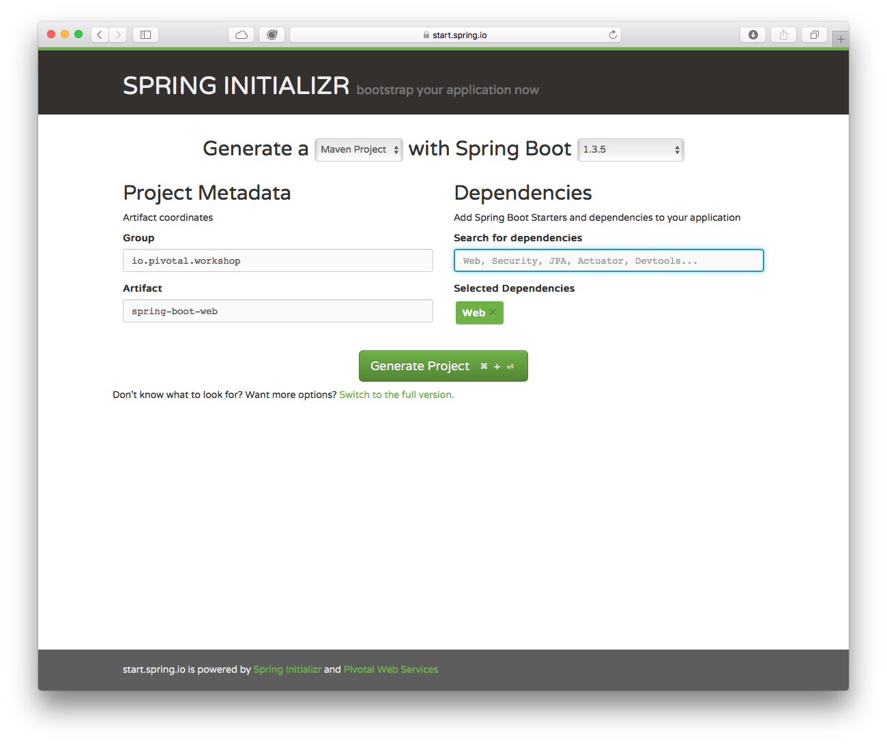
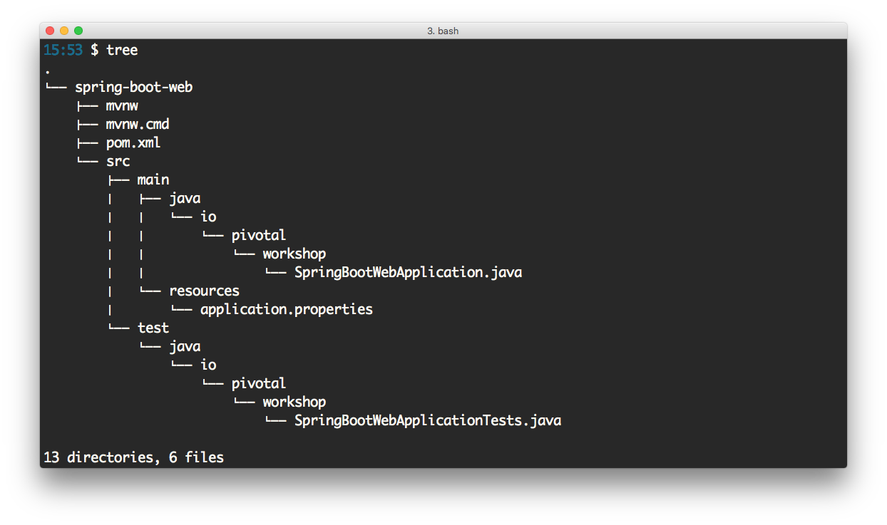

# Purpose of this lab
-  Review all the necessary steps that are required to create a simple Spring Web Application.
-  Get familiar with the Spring Initializr interface by creating a simple Spring Boot Web application with the Spring Boot project layout.
-  Get familiar with the STS IDE interface by creating a simple Spring Boot Web application.
-  Estimated time: 30 minutes

## 1. Create a Spring Web Application
#### Create the Spring Web directory structure
To create a simple Spring Web application, execute the following statement:

~~~
$ mvn archetype:generate -DgroupId=io.pivotal.workshop -DartifactId=simple-spring-webapp -Dversion=1.0-SNAPSHOT -DinteractiveMode=false -DarchetypeArtifactId=maven-archetype-webapp
~~~

<b>NOTE: In order to build and run this example, you need to have Maven installed. </b>

#### Follow the next steps:
-  Create the missing directory structure: src/main/webapp/WEB-INF, etc.
-  Create the web controller io.pivotal.workshop.web.SimpleController class in src/main/java/io/pivotal/workshop/web.
~~~~
package io.pivotal.workshop.web;

import org.springframework.stereotype.Controller;
import org.springframework.web.bind.annotation.RequestMapping;
import org.springframework.web.bind.annotation.RequestMethod;
import org.springframework.web.servlet.ModelAndView;

@Controller
@RequestMapping("/showMessage.html")
public class SimpleController {

    @RequestMapping(method = RequestMethod.GET)
    public ModelAndView helloWorld() {

        ModelAndView model = new ModelAndView("showMessage");
        model.addObject("message", "Spring MVC Web App with annotations");

        return model;
    }
}
~~~~

-  Modify the src/main/webapp/WEB-INF/web.xml file.
~~~
<?xml version="1.0" encoding="UTF-8"?>

<web-app xmlns="http://java.sun.com/xml/ns/javaee"
         xmlns:xsi="http://www.w3.org/2001/XMLSchema-instance"
         xsi:schemaLocation="http://java.sun.com/xml/ns/javaee
         http://java.sun.com/xml/ns/javaee/web-app_2_5.xsd"
         version="2.5">
  <display-name>Simple Spring Web Application</display-name>
  <servlet>
      <servlet-name>dispatcherServlet</servlet-name>
      <servlet-class>org.springframework.web.servlet.DispatcherServlet</servlet-class>
      <load-on-startup>1</load-on-startup>
  </servlet>

  <servlet-mapping>
      <servlet-name>dispatcherServlet</servlet-name>
      <url-pattern>/</url-pattern>
  </servlet-mapping>
</web-app>
~~~

-  Create the src/main/webapp/WEB-INF/dispatcherServlet-servlet.xml file.
~~~
<?xml version="1.0" encoding="UTF-8"?>

<beans xmlns="http://www.springframework.org/schema/beans"
    xmlns:xsi="http://www.w3.org/2001/XMLSchema-instance"
    xmlns:mvc="http://www.springframework.org/schema/mvc"
    xmlns:context="http://www.springframework.org/schema/context"
    xsi:schemaLocation="
    http://www.springframework.org/schema/mvc
    http://www.springframework.org/schema/mvc/spring-mvc.xsd
    http://www.springframework.org/schema/beans
    http://www.springframework.org/schema/beans/spring-beans.xsd
    http://www.springframework.org/schema/context
    http://www.springframework.org/schema/context/spring-context.xsd">

    <context:component-scan base-package="io.pivotal.workshop.web" />

    <bean class="org.springframework.web.servlet.view.InternalResourceViewResolver">
        <property name="prefix" value="/WEB-INF/view/"/>
        <property name="suffix" value=".jsp"/>
    </bean>

</beans>
~~~

-  Modify the src/main/webapp/index.jsp file. Pages
~~~
<!DOCTYPE html>

<%@ taglib prefix="c" uri="http://java.sun.com/jsp/jstl/core" %>

<html>
    <head>
        <meta charset="utf-8">
        <title>Welcome123</title>
    </head>
    <body>
        <c:url value="/showMessage.html" var="messageUrl" />
        <a href="${messageUrl}">Show the message</a>
    </body>
</html>
~~~

-  Create the src/main/webapp/WEB-INF/view/showMessage.jsp file. Pages
~~~
<!DOCTYPE html>

<%@ page language="java" contentType="text/html; charset=UTF-8" pageEncoding="UTF-8"%>

<html>
    <head>
        <meta charset="utf-8">
        <title>Welcome</title>
    </head>
    <body>
        <h2>${message}</h2>
    </body>
</html>
~~~
-  Modify the pom.xml file.
~~~
<project xmlns="http://maven.apache.org/POM/4.0.0"
    xmlns:xsi="http://www.w3.org/2001/XMLSchema-instance"
  xsi:schemaLocation="http://maven.apache.org/POM/4.0.0 http://maven.apache.org/maven-v4_0_0.xsd">
	<modelVersion>4.0.0</modelVersion>
	<groupId>io.pivotal.workshop</groupId>
	<artifactId>simple-spring-webapp</artifactId>
	<packaging>war</packaging>
	<version>1.0-SNAPSHOT</version>
	<name>simple-spring-webapp Maven Webapp</name>
	<url>http://maven.apache.org</url>

	<properties>

		<!-- Generic properties -->
		<java.version>1.8</java.version>

		<!-- Web -->
		<jsp.version>2.2</jsp.version>
		<jstl.version>1.2</jstl.version>
		<servlet.version>2.5</servlet.version>

		<!-- Spring -->
		<spring-framework.version>4.3.2.RELEASE</spring-framework.version>

	</properties>

	<dependencies>

		<!-- Spring MVC -->
		<dependency>
			<groupId>org.springframework</groupId>
			<artifactId>spring-webmvc</artifactId>
			<version>${spring-framework.version}</version>
		</dependency>

		<!-- Other Web dependencies -->
		<dependency>
			<groupId>javax.servlet</groupId>
			<artifactId>jstl</artifactId>
			<version>${jstl.version}</version>
		</dependency>
		<dependency>
			<groupId>javax.servlet</groupId>
			<artifactId>servlet-api</artifactId>
			<version>${servlet.version}</version>
			<scope>provided</scope>
		</dependency>
		<dependency>
			<groupId>javax.servlet.jsp</groupId>
			<artifactId>jsp-api</artifactId>
			<version>${jsp.version}</version>
			<scope>provided</scope>
		</dependency>
	</dependencies>

  <build>
    <finalName>simple-spring-webapp</finalName>
  </build>
</project>
~~~

### Building the Spring Web Application
-  To build the Spring Web application, execute the following command:
~~~
$ mvn clean package
~~~
the above command will generate the target/simple-spring-webapp.war

### Deploying the Spring Web Application
-  To deploy the application, install any application container that supports the Java Servlets specification.

For example, to deploy to Apache Tomcat, copy the target/simple-spring-webapp.war file into the TOMCAT-INSTALLATION/webapps/ directory and start the container. Then, go to your browser and hit the http://localhost:8080/simple-spring-webapp URL and click Show the message link.

You should see the text: Simple Spring MVC Web App

You can download the Apache Tomcat binary. The recommended version is Apache Tomcat 8.5.x.

## 2. Create a Spring Boot Web Application

#### Create a Spring Boot Web Application using the Spring Initializr
-  Open a browser and hit the url: http://start.spring.io
-  Fill out the Project metadata with:
-  Group: io.pivotal.workshop
-  Artifact: spring-boot-web
-  Type Web in the Dependencies field and press Enter.
-  Click the Generate Project button.

-  You will get a spring-boot-web.zip file. Uncompress the file and take a look at the layout.

-  Inspect the pom.xml file. See what is included.

~~~
<?xml version="1.0" encoding="UTF-8"?>
<project xmlns="http://maven.apache.org/POM/4.0.0" xmlns:xsi="http://www.w3.org/2001/XMLSchema-instance"
	xsi:schemaLocation="http://maven.apache.org/POM/4.0.0 http://maven.apache.org/xsd/maven-4.0.0.xsd">
	<modelVersion>4.0.0</modelVersion>

	<groupId>io.pivotal.workshop</groupId>
	<artifactId>spring-boot-web</artifactId>
	<version>0.0.1-SNAPSHOT</version>
	<packaging>jar</packaging>

	<name>spring-boot-web</name>
	<description>Demo project for Spring Boot</description>

	<parent>
		<groupId>org.springframework.boot</groupId>
		<artifactId>spring-boot-starter-parent</artifactId>
		<version>1.4.0.RELEASE</version>
		<relativePath/> <!-- lookup parent from repository -->
	</parent>

	<properties>
		<project.build.sourceEncoding>UTF-8</project.build.sourceEncoding>
		<project.reporting.outputEncoding>UTF-8</project.reporting.outputEncoding>
		<java.version>1.8</java.version>
	</properties>

	<dependencies>
		<dependency>
			<groupId>org.springframework.boot</groupId>
			<artifactId>spring-boot-starter-web</artifactId>
		</dependency>

		<dependency>
			<groupId>org.springframework.boot</groupId>
			<artifactId>spring-boot-starter-test</artifactId>
			<scope>test</scope>
		</dependency>
	</dependencies>

	<build>
		<plugins>
			<plugin>
				<groupId>org.springframework.boot</groupId>
				<artifactId>spring-boot-maven-plugin</artifactId>
			</plugin>
		</plugins>
	</build>

</project>
~~~
-  Modify the SpringBootWebApplication.java class to create a Web application.
~~~
package io.pivotal.workshop;

import org.springframework.boot.SpringApplication;
import org.springframework.boot.autoconfigure.SpringBootApplication;
import org.springframework.web.bind.annotation.RequestMapping;
import org.springframework.web.bind.annotation.RestController;

@RestController
@SpringBootApplication
public class SpringBootWebApplication {

	public static void main(String[] args) {
		SpringApplication.run(SpringBootWebApplication.class, args);
	}

	@RequestMapping("/")
	public String greetings(){
		return "Hello: Spring Boot!";
	}
}
~~~
Save your changes and run the application with:
~~~
$ mvn spring-boot:run
~~~
Navigate to http://localhost:8080 and you will see "Hello: Spring Boot!".

By default the <b>Spring Initializr</b> generates a <b>Maven</b> project and the generated <b>ZIP</b> file comes with a <b>Maven Wrapper</b>, this means that you don't need to download or setup <b>Maven</b>. 
<b>CONGRATULATIONS!</b> You have created a Spring Boot Web application using the <b>Spring Initializr!</b> Notice that the Spring Boot application requires less setup because of the opions that Spring Boot provides.
