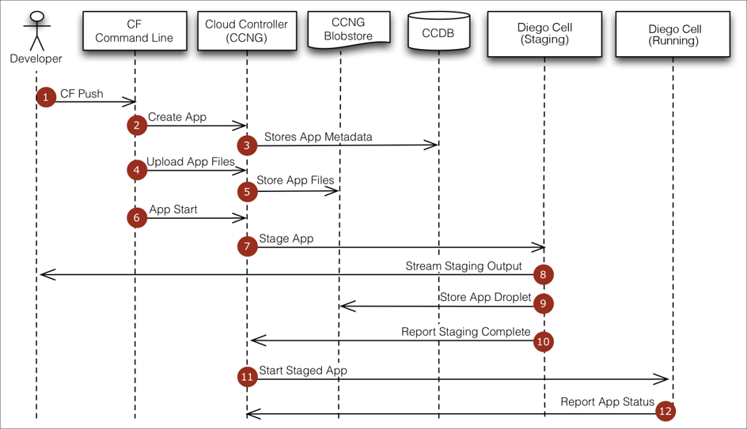

# Purpose of this lab
-  In this lab we will create a manifest file for the app we built in last lab of spring vs Spring boot lab, package your app and push it into PCF.
-  See and understand the flow of cf push.
-  Estimated time: 30 minutes

## Make Sure you have developed the Spring boot App in last lab, because we are going to push that one, If not please develop one using instructions from there.

## 1. Create a deployment manifest file
-  Go to Spring Boot App root directory.
-  In your preferred IDE:
  -  Create a new file  with following details.
~~~~
 applications:
- name: spring-boot-web
  instances: 1
  path: target/spring-boot-web-0.0.1.war
  random-route: false
  routes:
  - route: spring-boot-webTraining.cfapps.io
~~~~
-  Save file as
  -  manifest.yml
  -  make sure file saves at project root directory.

## 2. Login into PCF
-  In Powershell/command Prompt
  -  Login to PCF Web Service
  ~~~
  cf login -a api.run.pivotal.io
  ~~~

  -  Follow the prompt entering userid and password for PCF.
  -  If you have multiple org and spaces it will ask for input otherwise directly login to available one.

<b>HINT:</b> If you select the wrong space or org use command cf target -s to change it.

## 3. Build your App.
-  Use powershell or command prompt.
~~~
mvn Package
~~~

### 4. Push app into PCF
-  Make sure you are in project root directory and you have manifest file too in there.
-  Use powershell or command prompt.

~~~
cf Push
~~~

## 4. Flow of CF Push

## 5. Bird's eye on cf push logs result

You should see output similar to the steps below, an explanation of each steps is below.

-  The CLI is using manifest to provide necessary configuration for app to be deployed.
~~~
Using manifest file C:\Users\akesharw\Documents\MySpaceLD\TechBrowniesApp\manifest.yml
Getting app info...
Creating app with these attributes...
+ name:         spring-boot-web
  path:         C:\Users\akesharw\Documents\MySpaceLD\TechBrowniesApp
+ instances:    1
  routes:
+   spring-boot-webTraining.cfapps.io
~~~

-  In most cases , the CLI indicates each cloud Foundry  API calls as it happens.
~~~
Creating app spring-boot-web...
~~~

-  Now the CLI is binding the created route to the apps

~~~
Mapping spring-boot-webTraining.cfapps.io route to spring-boot-web
Ok
~~~

-  The CLI finally uploads the app bits to PCF.

~~~
Packaging files to upload...
Uploading files...
 37.60 MiB / 37.60 MiB [=================================================================================] 100.00% 1m59s

Done uploading
Ok
~~~

-  Now CLI begin the staging process. It will compare the app bits with available buildpacks to identify required buildpack needed to run the application.

~~~
Waiting for API to complete processing files...

Staging app and tracing logs...
   Downloading dotnet_core_buildpack_beta...
   Downloading nodejs_buildpack...
   Downloading staticfile_buildpack...
   Downloading dotnet_core_buildpack...
   Downloading go_buildpack...
   Downloaded staticfile_buildpack
   Downloading java_buildpack...
   Downloaded dotnet_core_buildpack_beta
   Downloading php_buildpack...
   Downloaded java_buildpack
   Downloading python_buildpack...
   Downloaded nodejs_buildpack (146M)
   Downloading binary_buildpack...
   Downloaded binary_buildpack
   Downloading ruby_buildpack...
   Downloaded python_buildpack (561.9M)
   Downloaded php_buildpack (505.5M)
   Downloaded ruby_buildpack (362.6M)
   Downloaded dotnet_core_buildpack (800.6M)
   Downloaded go_buildpack (864M)
   Cell b5e3eed0-6e53-49d1-aa8b-ce3443efac4a creating container for instance 95e72faa-f256-4675-90ff-9910b38725ee
   Cell b5e3eed0-6e53-49d1-aa8b-ce3443efac4a successfully created container for instance 95e72faa-f256-4675-90ff-9910b38725ee
   Downloading app package...
   Downloaded app package (41.4M)

   Staging...
   -----> Java Buildpack version: XXX
   Exit Status 0
   Staging Complete
~~~

-  Once the Staging is completed , the complete package of your app and buildpack is called DROPLET. here the droplet is being uploaded to Blobstore.
~~~
Exit status 0
   Uploading droplet, build artifacts cache...
   Uploading droplet...
   Uploading build artifacts cache...
   Uploaded build artifacts cache (130B)
   Uploaded droplet (62.8M)
   Uploading complete
   Cell 0a2078bd-a9b3-4bdf-91da-8a4c049f559c stopping instance 79bb1b71-db93-42b7-b895-7c82178abbc1
   Cell 0a2078bd-a9b3-4bdf-91da-8a4c049f559c destroying container for instance 79bb1b71-db93-42b7-b895-7c82178abbc1
   Cell 0a2078bd-a9b3-4bdf-91da-8a4c049f559c successfully destroyed container for instance 79bb1b71-db93-42b7-b895-7c82178abbc1

Waiting for app to start...
~~~

-  The CLI tells you exactly what command it used to start your app in container.
~~~
start command:   JAVA_OPTS="-agentpath:$PWD/.java-buildpack/open_jdk_jre/bin/jvmkill-1.16.0_RELEASE=printHeapHistogram=1
                 -Djava.io.tmpdir=$TMPDIR -XX:ActiveProcessorCount=$(nproc)
                 -Djava.ext.dirs=$PWD/.java-buildpack/container_security_provider:$PWD/.java-buildpack/open_jdk_jre/lib/ext
                 -Djava.security.properties=$PWD/.java-buildpack/java_security/java.security $JAVA_OPTS" &&
                 CALCULATED_MEMORY=$($PWD/.java-buildpack/open_jdk_jre/bin/java-buildpack-memory-calculator-3.13.0_RELEASE
                 -totMemory=$MEMORY_LIMIT -loadedClasses=14647 -poolType=metaspace -stackThreads=250
                 -vmOptions="$JAVA_OPTS") && echo JVM Memory Configuration: $CALCULATED_MEMORY && JAVA_OPTS="$JAVA_OPTS
                 $CALCULATED_MEMORY" && MALLOC_ARENA_MAX=2 SERVER_PORT=$PORT eval exec
                 $PWD/.java-buildpack/open_jdk_jre/bin/java $JAVA_OPTS -cp $PWD/.
                 org.springframework.boot.loader.WarLauncher
~~~

-  Finally the CLI reports you teh current health status with basic info of your app.
~~~
name:              AviteshApp
requested state:   started
routes:            aviteshapp.cfapps.io
last uploaded:     Thu 28 Mar 15:28:52 CDT 2019
stack:             cflinuxfs3
buildpacks:        client-certificate-mapper=1.8.0_RELEASE container-customizer=2.6.0_RELEASE
                   container-security-provider=1.16.0_RELEASE
                   java-buildpack=v4.18-offline-https://github.com/cloudfoundry/java-buildpack.git#a0df7d0
                   java-main java-opts java-security jvm...

type:            web
instances:       1/1
memory usage:    1024M
state     since                  cpu    memory     disk           details
#0   running   2019-03-28T20:29:14Z   0.0%   9M of 1G   143.7M of 1G
type:            task
instances:       0/0
memory usage:    1024M
~~~

<b>NOTE: you can get the app status of your app anytime by using belo command</b>
~~~
cf app <APP_NAME>
~~~
